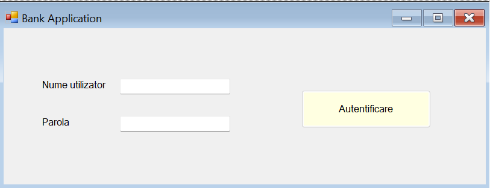

# BankApp_CSharp_MySQL

# User Interface Design

# Description
- the tool used is Visual Studio 2019, Windows Forms App (.NET Framework)
- the application is realised with .NET Framework using the C# programming language.
- I used MySQL Workbench for the "bankapp_mysql_db" data base.

